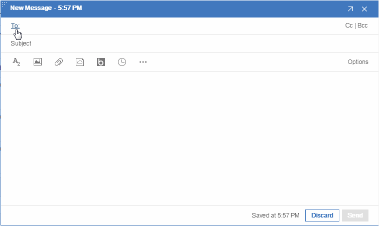

# custom-name-picker-with-organization-tree

This is a sample of custom name picker with organization tree for VoP(Verse on-Premises) 1.0.2 and VoC(Verse on-Cloud).

## Demo

## How to run this sample

### Prerequisites

This is a [Nodejs](https://nodejs.org/en/) project. Please make sure that you have installed the latest Nodejs before try this demo.

### Steps

1. Clone this repository
1. Run `npm i` in the root folder of the cloned project
1. Run `npm run server` to start the server
1. Open http://127.0.0.1:8080 in your browser, you should see the sample custom name picker with organization tree UI
1. Use the applications.json under the root folder of the cloned project to register Verse applications. You have several options to register applications into Verse.
    1. If you want to try this sample on your personal client, you can locally register applications through IBM Verse Developer Browser Extension. The tutorial is [here](https://ibmverse.github.io/verse-developer/developers/#get-started).
    1. If you want to register applications for your organization, you need to register it through VoP Extensibility. Please take the section *"Deploy application on Verse on-Premise"* of [Registering an Application in IBM Verse](https://ibmverse.github.io/verse-developer/developers/#registering-an-application-in-ibm-verse) as a reference.
1. Check the `originsList` variable in `src/javascripts/index.jsx`, please add your VoP server hostname in it.
1. Login Verse with web browser and make sure you have enabled feature `custom-name-picker`.
1. It should be good to try in VoP now !

This sample works with Chrome/Firefox/IE11.

## About the data

The data in this sample is fake. Related codes are in file `/utils.js` and file `/src/javascripts/service/api.js`. You can modify corresponding code logic according to your requirements.

## License

[MIT licensed](./LICENSE)
